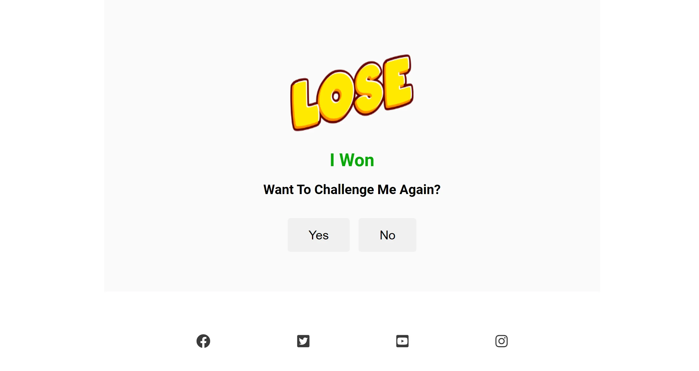

# The Cycle Of Life Game

The Cycle Of Life Game is a game created in the style of rock, paper, scissors. There are three options for the player to select - Human, Plant and Soil. The aim of the game is to select as many correct options as possible to beat the computer. A total of seven attempts are allowed before the game ends and decides the winner. The rules of the game are included on the index page and as well as winning or losing a player can also tie with the computer.

The deployed site can be found here <https://todiane.github.io/cycle-of-life-p2/>

Project Aims to:

- provide XXXXXXXXXXXXXXXXXXXXXXXXXinformation on the
- outline bXXXXXXXXXXXXXXXXXXXXXXXXXXXXXXenefits of
- provide sociaXXXXXXXXXXXXXXXXXXXXXXXXXXXXl proof
- set XXXXXXXXXXXXXXXXXXXXXXXup a working registrat
- encourage aXXXXXXXXXXXXXXXXXXXXXnyone interested

## Features

### **Header**

The header shows the name of the game and provides information on how to win the game.

### **Game Area**

The game area shows the score of the player and the computer and underneath that area is the game selection area where a player can select either Human, Plant or Soil. Instructions are provided on how to start the game so the player understands that the game only starts once they have made their first selection.

### **Instructions**

Under the game area are instructions/rules on which element wins or loses against the other.

### **Footer Area**

Under the game instructions area and outside of the main game area is the footer which includes links to social media networks.

## **Website Pages**

As well as the main game area, the following webpages are also deployed at the end of the game

**_Winner Page_**
This page displays if the player wins the game and provides an oportunity for them to play again or exit the game. The social media buttons are also present.

**_Lose Page_**

This page displays if the player loses the game and provides an oportunity for them to play again or exit the game. The social media buttons are also present.

**_Thank You Page_**

This page displays if the player selects the NO button on either the winner or lose pages. It also provides a final opportunity to play the game again. The social media buttons are also present.

## **Testing**

- The website has been tested to work in different browers including Chrome, Firefox and Edge.

- The @media code has been added and tested to ensure the game keeps its structure at the lowest screen size of 320 x 480 px.

- All links to external pages in the social media footer have been checked.

- I tested that all parts of the game work including the score area and game selection area plus the additonal webpages and their buttons.

- I tested that the instructions were easy to understand.

## **Validator Testing**

**_Javascript_**

The Javascript was run through JS Hint Javascript Validator -  https://jshint.com/
Two unused variables were detected and removed.

**_HTML_**
The HTML code was run through W3C Validator and found duplicate IDs for game images, id="imgChoice" on line 34 of index page. This was updated to include imgChoice1 and imgChoice2 plus the CSS file was updated to include the same image size instructions. There were also a couple of stray end divs to remove.
Once completed no other errors were found when the code was entered into the validator
 

**_CSS_**
No errors were found when the code was entered into the official CSS Jigsaw validator

**_Accessibility_**

The site was run through the DevTools Lighthouse section and given a 98% score for accessibility.

## **Unfixed Bugs**

No unfixed bugs to report.

## **Features To Implement**

When there is more time I would like to add additional items to the human, plant, soil options so there are at least five different options.

## **Deployment**

The site was deployed to GitHub pages. The steps to deploy are as follows:

- In the GitHub repository, navigate to the repositories on the right and click on the relevant one to open up the project.
- Go to Settings tab and then down to the tab called Pages.
- From the source section drop-down menu, select "Deploy from a branch".
- Directly under is Branch. Select "main" and "root" then click on save.
- A few minutes later GitHub will provide a link to the live site which indicates successful deployment.

The live link can be found here - <https://todiane.github.io/cycle-of-life-p2/>

## **Credits**

The Cycle of Life footer structure has been created using html and css code elements from the Code Institute Love Running website. The Love Running three page website has been recreated for this project. <https://code-institute-org.github.io/love-running-2.0/index.html>

Photos used in the game and on all website pages were created by me using Canva

Font awesome icons were used from <https://fontawesome.com>

My mentor Andre Aquilina for his support with javascript throughout my project
